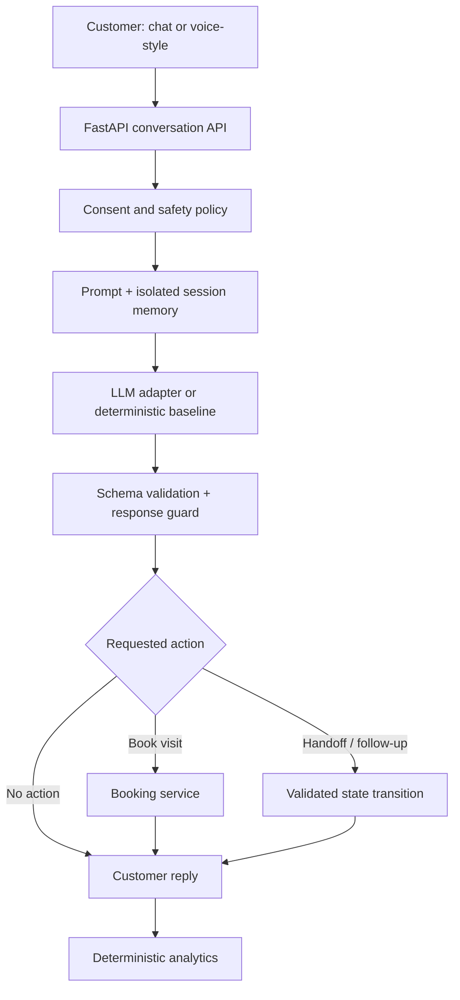

# Northstar Homes AI Sales Agent

A multilingual real-estate sales agent built for the **Huvo AI Forward Deployed Engineer assignment**. It qualifies a lead, answers only from confirmed facts, handles objections, respects stop-contact requests, simulates site-visit booking, and produces structured analytics.

The backend is **Python FastAPI**, as required. The interface is dependency-light HTML, CSS, and JavaScript. The same system prompt controls both normal chat and concise voice-style interactions.

## Verified status

| Check | Measured result |
|---|---:|
| Automated tests | 46 passed |
| Branch-aware code coverage | 89% |
| Behavioural scenarios | 9/9 passed |
| Deterministic agent latency | p50 0.61 ms; p95 1.03 ms |
| Live external-model benchmark | Not measured; no API key used |

See the committed [behavioural evaluation report](evaluation/results.md) for every input, expected behaviour, actual response, and pass/fail result.

> The verified results cover the deterministic baseline and application guardrails. They do not claim perfect behaviour for every possible customer message or external model response.

## What is included

- Final production-style [system prompt](prompts/NORTHSTAR_AGENT_SYSTEM_PROMPT.md)
- English, Hindi, and Hinglish conversations
- Chat mode and voice-style response mode
- Conversation memory with session isolation and automatic expiry
- Lead qualification: configuration, budget, purpose, timeline, and location
- Price, busy, uninterested, unknown-question, and comparison boundaries
- Hard do-not-contact enforcement before any model call
- Safe booking tool with success, failure, alternatives, and idempotency
- Human escalation and clean conversation endings
- Deterministic lead scoring and conversation analytics
- Offline demo engine, plus OpenAI-compatible model adapter
- Post-model guardrail against invented prices and false booking claims
- Rate limits, body limits, security headers, trusted hosts, CORS, and redacted logs
- Responsive and accessible web interface
- Docker, CI, health checks, tests, evaluation dataset, and documentation

## Quick start

### Option A: uv

```bash
git clone https://github.com/kunalwagh101/northstar-agent.git
cd northstar-agent
cp .env.example .env
uv sync --extra dev
uv run uvicorn app.main:app --reload
```

Open [http://localhost:8000](http://localhost:8000).

### Option B: pip

```bash
python -m venv .venv
source .venv/bin/activate        # Windows: .venv\Scripts\activate
pip install -r requirements-dev.txt
uvicorn app.main:app --reload
```

### Option C: Docker

```bash
cp .env.example .env
docker compose up --build
```

The default `.env.example` uses `AI_PROVIDER=demo`, so the application works without an API key.

The project includes Python's first-party `tzdata` package so IANA timezones such as
`Asia/Kolkata` also work on Windows, where a system timezone database is normally absent.

## Use an external AI model

The deterministic demo engine makes the repository testable without secrets. To exercise the final system prompt with an OpenAI-compatible Chat Completions API:

```dotenv
AI_PROVIDER=openai
OPENAI_API_KEY=your_key_here
OPENAI_BASE_URL=https://api.openai.com/v1
OPENAI_MODEL=gpt-4.1-mini
FALLBACK_TO_DEMO=true
```

Restart the server. Never commit `.env`; it is ignored by Git.

The model returns a validated JSON turn containing the reply, extracted lead updates, intent, and requested action. The model is **not allowed to confirm bookings itself**. FastAPI validates the request and runs the booking tool before creating the customer-facing confirmation.

## Architecture



The system deliberately separates three concerns:

| Layer | Responsibility |
|---|---|
| System prompt | Language, tone, qualification policy, objections, unknown questions, and conversational judgement |
| Deterministic policy | Do-not-contact, session state, input validation, factual output guard, and analytics |
| Tools | Booking availability, booking confirmation, failure reason, alternatives, and idempotency |

This is safer than asking one prompt to do everything.

## Why this is not RAG

Northstar One has only five confirmed facts. RAG would add embeddings, retrieval failure modes, latency, and operational cost without improving the answer. The facts remain in the versioned system prompt and a typed backend object.

RAG becomes useful when the product supports many projects, large brochures, changing policies, and document-level source citations. See [Architecture and AI assessment](docs/ARCHITECTURE.md) for the decision record.

## API

| Method | Endpoint | Purpose |
|---|---|---|
| `GET` | `/` | Web interface |
| `POST` | `/api/sessions` | Create an isolated conversation |
| `POST` | `/api/chat` | Send one customer turn |
| `GET` | `/api/sessions/{id}/analytics` | Generate current lead analytics |
| `DELETE` | `/api/sessions/{id}` | Delete conversation memory |
| `GET` | `/api/project` | Return confirmed project facts |
| `GET` | `/healthz` | Liveness check |
| `GET` | `/readyz` | Readiness check |
| `GET` | `/api/metrics` | Demo operational counters and latency |

Interactive API documentation is available at `/docs` outside production mode.

Example:

```bash
SESSION_ID=$(curl -s -X POST http://localhost:8000/api/sessions \
  -H 'Content-Type: application/json' \
  -d '{"channel":"chat"}' | python -c 'import json,sys; print(json.load(sys.stdin)["session_id"])')

curl -s -X POST http://localhost:8000/api/chat \
  -H 'Content-Type: application/json' \
  -d "{\"session_id\":\"$SESSION_ID\",\"message\":\"Mujhe 3 BHK chahiye\",\"channel\":\"chat\"}"
```

## Booking simulation rules

- Timezone: Asia/Kolkata
- Visiting days: Monday–Saturday
- Visiting hours: 10:00 AM–5:00 PM
- Slot size: 30 minutes
- 1:00–2:00 PM is blocked
- Past, Sunday, invalid, occupied, and outside-hours slots fail explicitly
- A failed request returns up to three valid alternatives
- A repeated request from the same session is idempotent
- A second session cannot claim an occupied slot

These are assignment assumptions, not facts supplied by Northstar Homes. They exist only to make booking success and failure testable.

## Analytics contract

Analytics are derived from validated conversation state, not generated by a second LLM call. Fields include:

```json
{
  "preferred_language": "hinglish",
  "configuration": "3 BHK",
  "budget": "₹2 crore",
  "purchase_purpose": "self-use",
  "purchase_timeline": "3 months",
  "interest_level": "high",
  "lead_score": 85,
  "qualification_completeness": 80,
  "site_visit_status": "booked",
  "follow_up_required": false,
  "do_not_contact": false,
  "human_escalation_required": false
}
```

The transparent scoring formula is documented in [Architecture and AI assessment](docs/ARCHITECTURE.md). It is a prioritisation rule, not a prediction of purchase probability.

## Test and evaluate

```bash
# Lint and formatting check
uv run ruff check app tests scripts
uv run ruff format --check app tests scripts

# Automated suite with branch coverage
uv run pytest --cov=app --cov-report=term-missing

# Behavioural cases; exits non-zero on any failure
uv run python scripts/run_evaluation.py --check

# Regenerate the human-readable actual-output report
uv run python scripts/run_evaluation.py
```

The cases cover successful and failed booking, memory, Hindi, Hinglish, price objection, busy callback, clear disinterest, do-not-contact, unknown information, human handoff, prompt injection, provider failure, and fabricated model output.

## Repository structure

```text
app/
├── api/                 # FastAPI routes
├── core/                # Settings, logs, middleware, metrics
├── domain/              # Typed domain models and safety policy
├── infrastructure/      # LLM adapters and session store
├── services/            # Agent orchestration, booking, analytics, guardrails
├── static/              # Accessible HTML/CSS/JavaScript interface
├── container.py         # Dependency composition
└── main.py              # Application factory
prompts/                 # Final system prompt
evaluation/              # Behaviour cases and committed actual results
scripts/                 # Repeatable evaluation runner
tests/                   # Unit, API, safety, provider, and workflow tests
docs/                    # Architecture, product, security, and submission guides
```

## Important design decisions

- **AI is used only where it helps:** natural multilingual understanding and flexible conversation.
- **Rules protect irreversible outcomes:** consent, booking, state transitions, and analytics do not depend on model obedience.
- **No RAG:** too little knowledge; direct confirmed facts are more accurate.
- **No fine-tuning:** there is no labelled dataset, and prompt iteration is faster and auditable.
- **No database in this take-home:** memory is isolated and TTL-bound in process. The interface is ready for Redis/PostgreSQL replacement.
- **Graceful degradation:** a provider outage can fall back to the deterministic engine without inventing an answer.

## Assumptions

- The task requires a text interface, not real telephony.
- “Voice suitable” means concise, speakable responses and channel-aware behaviour.
- Booking is intentionally simulated; no real customer, calendar, CRM, or property inventory is touched.
- All times are IST.
- The fictional project facts supplied in the assignment are the complete source of truth.
- Contact details are optional for the demo because there is no real follow-up integration.

## Known limitations

- In-memory sessions are per process and disappear on restart. Production should use Redis/PostgreSQL.
- Rate limiting and metrics are also per process.
- The offline engine covers common assignment cases but is not full natural-language intelligence.
- Hindi and Hinglish quality with a live model needs a native-speaker evaluation set.
- No real CRM, calendar, WhatsApp, consent ledger, telephony, or human queue is connected.
- No live external-model benchmark is reported because no key was used during verification.
- Prompt injection cannot be solved by prompting alone; this project reduces impact through action isolation and output validation.

## Production path

For real deployment: replace memory with Redis/PostgreSQL, place the API behind authenticated tenant boundaries, use a consent ledger, connect calendar/CRM tools with least-privilege credentials, add distributed rate limiting, send OpenTelemetry traces without chat content, run prompt-version canaries, and maintain a multilingual human-reviewed evaluation set.

Full details are in:

- [Architecture and AI assessment](docs/ARCHITECTURE.md)
- [Product and business logic](docs/PRODUCT_AND_BUSINESS.md)
- [Security review](docs/SECURITY.md)
- [Prompt design](docs/PROMPT_DESIGN.md)
- [Demo video script](docs/DEMO_VIDEO_SCRIPT.md)
- [Submission email](docs/SUBMISSION_EMAIL.md)

## AI tools used

AI-assisted development tools supported architecture research, prompt drafting, implementation, testing, and documentation. Every behavioural claim in this repository comes from repeatable local tests; no unmeasured model result is presented as verified.

## Licence

MIT. See [LICENSE](LICENSE).
