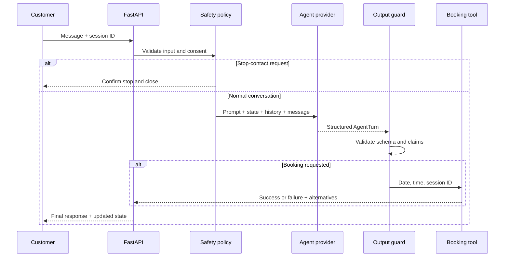
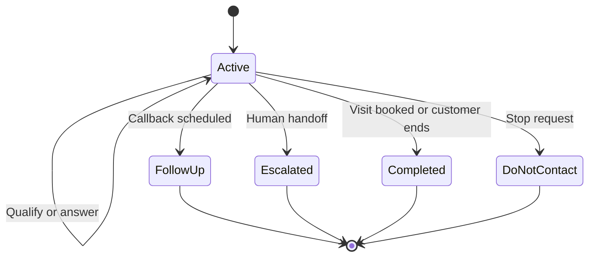
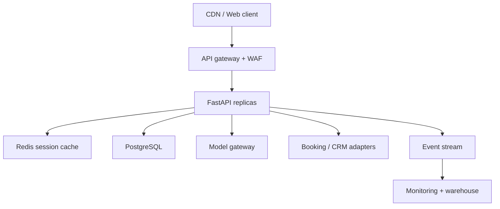

# Architecture and AI Assessment

## Executive decision

Build a **hybrid conversational agent**:

- An LLM handles natural English, Hindi, Hinglish, intent, and conversational phrasing.
- Deterministic code owns consent, state transitions, booking, factual output checks, and analytics.
- A deterministic offline engine provides the simplest measurable baseline and safe provider fallback.
- RAG, fine-tuning, classical ML, and model training are rejected for this assignment because the knowledge base contains only five confirmed facts and no labelled data.

This is the smallest design that demonstrates the requested agent behaviour without pretending that a prompt alone can safely execute business actions.

## 1. Exact problem

Northstar Homes needs a conversational sales agent that can respond through text now and remain suitable for voice later. The agent must understand a buyer, answer within a strict factual boundary, qualify interest, respect communication consent, and move an interested buyer towards a site visit.

The failure cost is asymmetric:

- A slightly awkward sentence is low impact.
- A fake discount, fake availability, false booking, or ignored stop request is high impact.

The architecture therefore gives flexible language to AI while keeping high-impact decisions in typed code.

## 2. Measurable success criteria

| Area | Acceptance target | Evidence in this repository |
|---|---:|---|
| Confirmed-price accuracy | 100% in evaluation set | Price and hallucination guard tests |
| Do-not-contact enforcement | 100%; no model/tool call after detection | Policy bypass test and DNC scenario |
| Booking integrity | 100%; confirmation only after tool success | Booking unit and API tests |
| Failed booking clarity | Must state not booked and offer valid alternatives | Sunday failure scenario |
| Session memory | Previously shared fields remain available | Multi-turn analytics test |
| Language matching | Correct English/Hindi/Hinglish in covered cases | Language tests and evaluation cases |
| Unknown information | No invented answer; offer human help | Amenities scenario |
| Voice suitability | At most one question and normally under 55 words | Prompt rule and voice cases |
| Schema safety | Invalid model output rejected | Provider adapter tests |
| Code quality | At least 85% branch-aware coverage | Measured 89% |
| Offline latency | p95 below 50 ms for agent logic | Measured 1.03 ms in current run |

These are evaluation-set results, not claims of universal real-world accuracy.

## 3. Customer and business objective

Primary customer: a prospective home buyer responding to a real-estate lead campaign or website.

Business user: Northstar Homes' sales team, which wants a complete lead profile and a clear next action instead of an unstructured chat transcript.

Business objective: increase qualified site visits while reducing manual time spent on repetitive early-stage conversations, without harming trust through false claims or unwanted contact.

## 4. Data assessment

### Available knowledge

| Field | Value | Quality |
|---|---|---|
| Company | Northstar Homes | Confirmed by assignment |
| Project | Northstar One | Confirmed by assignment |
| Location | Sector 79, Gurugram | Confirmed by assignment |
| Configurations | 2 BHK, 3 BHK | Confirmed by assignment |
| Starting prices | ₹1.35 crore and ₹1.75 crore onwards | Confirmed by assignment |

Quantity: five facts. No brochure, FAQ set, historical transcripts, inventory feed, calendar, CRM records, labels, or outcome data were supplied.

### Data risks

- No source timestamps: the bot cannot know whether a price later changed.
- No real availability: booking is a simulation, not an inventory commitment.
- No consent ledger: DNC applies to the current demo session only.
- No native-speaker-labelled Hindi/Hinglish dataset: language quality cannot be statistically claimed.
- Lead scoring has no conversion labels: it is a transparent prioritisation rule, not a trained probability model.

### Bias and privacy

The agent must not infer income, caste, religion, gender, family status, creditworthiness, or protected characteristics. It stores only information the user voluntarily provides. Logs exclude message text and API keys. Phone numbers are not returned in analytics; only `phone_provided` is exposed.

## 5. Is AI genuinely needed?

Partly.

Rules alone can answer five facts and run a booking workflow. They cannot economically cover the variation of English, Hindi, Hinglish, corrections, objections, indirect intent, and natural follow-up at production scale.

AI is therefore justified for language understanding and response generation. AI is not justified for do-not-contact enforcement, booking confirmation, or lead-score arithmetic.

## 6. Baseline and selected approach

The offline deterministic engine is the baseline. It covers the assignment's common intents with patterns and explicit state transitions. It is fast, free, repeatable, and easy to test. Its weakness is limited language coverage.

The selected production path is an LLM behind the same typed `AgentProvider` interface. The LLM receives the versioned system prompt, recent conversation, and trusted state, then returns a validated `AgentTurn`. It can request an action but cannot execute one.

### Alternatives considered

| Approach | Decision | Reason |
|---|---|---|
| Pure rules | Baseline only | Reliable but brittle for natural multilingual conversation |
| Prompted LLM | Selected for language | Best fit for flexible intent and phrasing |
| RAG | Rejected now | Five facts do not justify retrieval infrastructure or retrieval failure risk |
| Fine-tuning | Rejected | No labelled conversation dataset; slower to iterate and harder to audit |
| Classical ML intent classifier | Rejected | No labels and unnecessary beside structured LLM output plus safety rules |
| Deep-learning model training | Rejected | No data, high cost, no product advantage |
| Fully autonomous agent | Rejected | Excessive authority for booking and consent-sensitive workflows |

## 7. Component architecture

| Component | Current implementation | Scale replacement |
|---|---|---|
| Web UI | Static HTML/CSS/JavaScript | CDN-hosted frontend or maintained design system |
| API | FastAPI | Horizontally scaled FastAPI containers |
| Session memory | TTL in-process store | Redis for active state; PostgreSQL for durable history |
| Agent model | Demo rules or OpenAI-compatible adapter | Versioned model router with canaries |
| Prompt | Versioned Markdown | Prompt registry with approval and rollback |
| Booking | In-memory calendar simulation | Calendar/CRM adapter with idempotency key |
| Analytics | Deterministic Python rules | Event pipeline plus warehouse metrics |
| Metrics | In-process counters | OpenTelemetry and Prometheus-compatible backend |
| Rate limit | Per-process sliding window | Redis or API-gateway distributed limit |

## 8. Data flow



### Booking invariant

`site_visit_status = booked` is possible only when `BookingService.book()` returns `success=true`. A model-generated sentence cannot create that state.

### Consent invariant

A recognised DNC message bypasses the provider and tools, clears pending follow-up, records DNC, ends the session, and returns one acknowledgement.

## 9. Conversation state model



Terminal sessions do not continue selling. A new user-initiated session is required.

## 10. Production database schema

The assignment implementation intentionally uses ephemeral memory. A production PostgreSQL schema would be:

```sql
create table conversations (
  id uuid primary key,
  tenant_id uuid not null,
  channel text not null check (channel in ('chat', 'voice')),
  status text not null,
  end_reason text,
  prompt_version text not null,
  model_version text not null,
  created_at timestamptz not null default now(),
  updated_at timestamptz not null default now(),
  expires_at timestamptz not null
);

create table lead_profiles (
  conversation_id uuid primary key references conversations(id) on delete cascade,
  name_ciphertext bytea,
  phone_ciphertext bytea,
  language text not null,
  configuration text,
  budget_crore numeric(10,2),
  purchase_purpose text,
  purchase_timeline text,
  interest_level text,
  lead_score smallint check (lead_score between 0 and 100),
  do_not_contact boolean not null default false,
  human_escalation_required boolean not null default false
);

create table messages (
  id bigint generated always as identity primary key,
  conversation_id uuid not null references conversations(id) on delete cascade,
  role text not null check (role in ('user', 'assistant')),
  content_ciphertext bytea not null,
  created_at timestamptz not null default now()
);

create table bookings (
  id uuid primary key,
  conversation_id uuid not null references conversations(id),
  idempotency_key text not null unique,
  requested_at timestamptz not null,
  confirmed_at timestamptz,
  status text not null,
  failure_reason text,
  provider_reference text
);

create unique index one_confirmed_booking_per_slot
  on bookings (confirmed_at)
  where status = 'booked';

create table consent_events (
  id bigint generated always as identity primary key,
  tenant_id uuid not null,
  subject_hash text not null,
  event_type text not null,
  source_conversation_id uuid,
  created_at timestamptz not null default now()
);

create table agent_events (
  id bigint generated always as identity primary key,
  conversation_id uuid not null references conversations(id),
  event_type text not null,
  prompt_version text not null,
  model_version text not null,
  latency_ms integer,
  input_tokens integer,
  output_tokens integer,
  created_at timestamptz not null default now()
);
```

Production messages and PII should be encrypted with managed keys. Analytics should use de-identified events wherever possible.

## 11. API and concurrency design

The API uses server-generated high-entropy session IDs. Pydantic rejects extra fields and overlong input. A per-session lock serialises turns so simultaneous messages cannot corrupt state. Booking uses a separate lock, a unique slot, and idempotent retry semantics.

At scale:

- Store active session state in Redis with TTL and optimistic versioning.
- Use PostgreSQL unique constraints as the final booking concurrency boundary.
- Require a tenant-scoped signed session token rather than accepting a bare identifier.
- Put distributed rate limits and request-size limits at the gateway and application layers.
- Use an outbox table for CRM and notification events.

## 12. Model strategy

The model is configured through environment variables. The adapter requests low-temperature JSON and validates it with `AgentTurn`. Invalid output fails closed or uses the deterministic fallback.

No model is trained by this project. Model choice should be based on a multilingual evaluation set containing real estate intents, code-switching, interruptions, dates, numbers, objections, and adversarial requests.

Recommended selection score:

```text
0.35 factual accuracy
+ 0.20 consent and safety compliance
+ 0.15 intent/action accuracy
+ 0.15 Hindi/Hinglish human rating
+ 0.10 latency score
+ 0.05 cost score
```

A cheaper model should not ship if it lowers booking or consent correctness.

## 13. Evaluation strategy

### Current automated evidence

- Unit tests for booking, memory, prompt loading, analytics, and guards
- API workflow tests across English, Hindi, and Hinglish
- Provider contract tests with mocked HTTP
- Provider outage fallback test
- Unsafe-model-output test
- Nine end-to-end behavioural cases with committed actual responses
- 89% branch-aware coverage

### Production evaluation dataset

Build a de-identified, consented dataset with at least:

- 100 English conversations
- 100 Devanagari Hindi conversations
- 150 Hinglish/code-switched conversations
- 100 objection and unknown-information cases
- 100 date, time, correction, and failed-action cases
- 100 adversarial, consent, and prompt-injection cases

Each case needs expected intent, accepted facts, forbidden claims, required action, language rating, and end state. A native Hindi reviewer should score naturalness. Hold out 20% as a regression set that prompt authors do not tune against.

## 14. Accuracy, cost, and latency

### Measured

- Deterministic cases: 9/9 passed.
- Automated tests: 45 passed.
- Current deterministic p50: 0.61 ms.
- Current deterministic p95: 1.03 ms.
- External inference cost: ₹0 in deterministic mode.

### Not measured

No live API key was used, so this repository makes no claim about live-model accuracy, latency, token use, or cost.

For a selected model, measure:

```text
cost_per_conversation =
  (input_tokens / 1,000,000 × input_price)
  + (output_tokens / 1,000,000 × output_price)
  + tool/provider costs
```

Track p50, p95, and p99 end-to-end time, not only model time. Voice typically needs a stricter response-time budget than chat; streaming and shorter turns become important.

## 15. MLOps, monitoring, and rollback

Version together:

- Prompt hash and semantic version
- Model and provider version
- Output schema version
- Booking tool version
- Evaluation dataset version

Monitor:

- Factual-boundary intervention rate
- Invalid model-output rate
- DNC detection and post-DNC contact attempts
- Booking request/success/failure and double-book conflicts
- Human escalation rate
- Unknown-question rate by topic
- Language distribution and human quality score
- p50/p95/p99 latency, token count, cost, timeouts, and fallbacks
- Lead-to-site-visit conversion outside the model quality score

Do not put raw phone numbers or message text in standard logs.

Deployment strategy:

1. Run the full regression set.
2. Shadow the candidate prompt/model without acting on tools.
3. Canary 5% of eligible conversations.
4. Compare safety, quality, latency, and business metrics.
5. Roll forward gradually.
6. Automatically route back to the last known-good prompt/model if invalid output, hallucination guard, timeout, or DNC failure crosses threshold.

Prompt rollback must not require a code deployment.

## 16. Scaling and performance

The FastAPI layer is stateless after externalising memory. Horizontal scaling is then straightforward. The largest latency source will be external inference, not Python logic.

Recommended production topology:



Cache project facts and prompt versions by immutable version key. Do not cache personalised replies. Use timeouts, bounded retries with jitter, circuit breakers, and backpressure. Never retry a booking without an idempotency key.

## 17. Known failure cases

- A novel DNC phrase may evade the deterministic detector; the model prompt adds a second layer but is not a guarantee.
- Relative date language can be ambiguous, especially Hindi “kal.” The production voice agent should confirm the full date.
- A live model may produce awkward code-switching even when its state/action is correct.
- Output guards cover high-impact known claims but cannot prove every sentence true.
- In-process memory, limits, and metrics do not coordinate across workers.
- The scoring rule may not correlate with actual purchase conversion until calibrated with outcomes.
- A human handoff is only recorded, not delivered to a real queue.
- Site-visit rules are assumptions created for the demo, not supplied property facts.

These limitations are explicit so the project does not confuse a strong take-home demonstration with a finished regulated production system.
